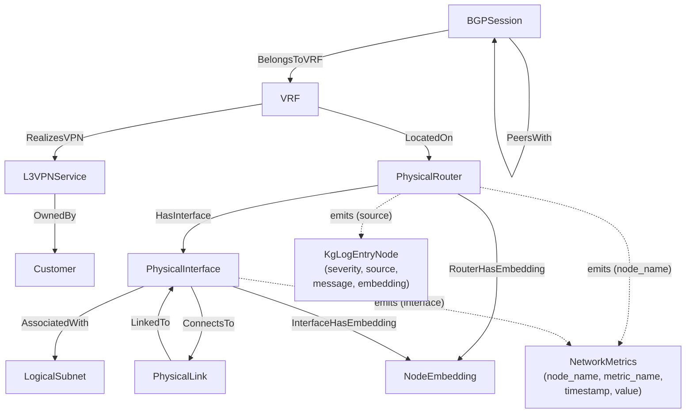
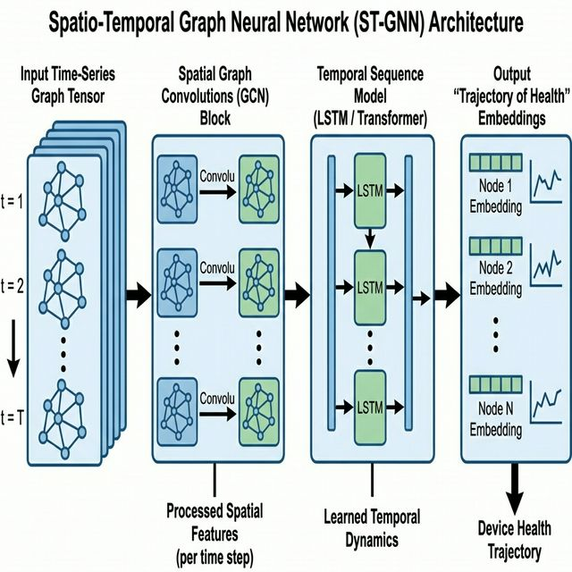
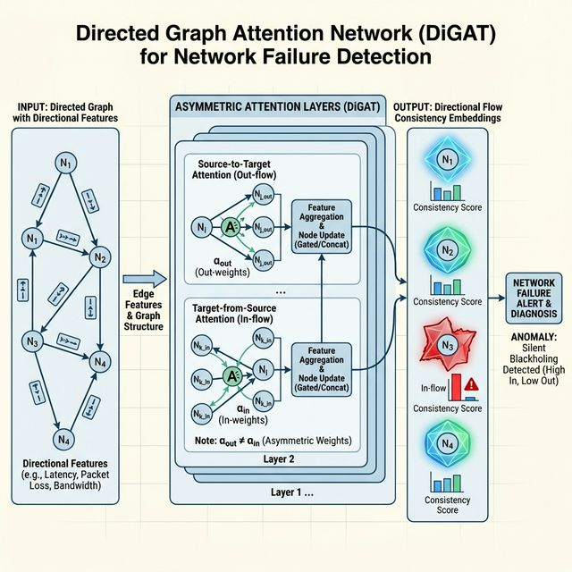
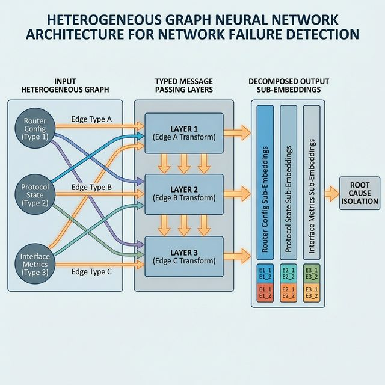

# Digital Twin Research

The document describes how to build a **Digital Twin** of a network using Graph Neural Networks (GNNs) combined with temporal modeling (like LSTMs or Transformers).

## Background

Graph Neural Networks learn the deep state of a network over time, modelling network devices, interfaces and their connections. The network is represented as a graph where nodes are devices and edges are connections between devices. 

Captured device state includes configuration, status and metrics, interface features include performance metrics. 

Once the GNN is trained embeddings representing the state of each device, interface and connection are generated. When an error in the network occurs the embeddings changes can point to the cause in the device embedding. 

This document is a place to collect research on techniques that can pinpoint the root cause of a failed device or interface using the embeddings collected over time. 

Deep learning embeddings are great at capturing state, but poor at explaining *why* that state exists. Specific techniques to bridge the gap between an abstract embedding and a concrete root cause (e.g., "Device A is failing because `MTU_Size` was misconfigured") are described below.

This document uses a VyOS network as a case study. A number of VyOS routers are connected to deliver a L3 VPN service. 

# Common failures to watch for / predict

When building a Digital Twin and training a GNN on network state, here are common fault injection scenarios and real-world failures to watch for and model:

1. **Silent Blackholing:** Routing protocols (BGP/OSPF) show as UP, but data plane traffic is silently dropped (e.g., due to MTU mismatches, bad ACLs, or corrupted forwarding tables).
2. **Microburst Congestion:** Transient traffic spikes that fill interface buffers and cause packet drops, often leaving little trace in 5-minute averaged metric collection.
3. **Control Plane Overload:** Sudden spikes in CPU or memory due to route churn, broadcast storms, or DDoS attacks, leading to delayed protocol hellos and adjacency flaps.
4. **Hardware Degradation:** Failing optical transceivers (SFP/QSFP) creating intermittent CRC errors, or slow memory leaks consuming device resources over time.
5. **Configuration Drift ("Fat Fingers"):** Accidental changes to route maps, VLAN tags, or protocol timers that shift traffic sub-optimally without explicitly bringing down links.
6. **Asymmetric Routing Issues:** Network topology changes causing traffic to take different forward and return paths, impacting stateful firewalls or latency-sensitive applications.

# Modelling Network State

The network state data model is stored in Google Cloud Spanner and represents both the **physical network topology** and the **logical service overlay**, supporting bi-temporal queries (valid-time history via `valid_start_ts` / `valid_end_ts`). Spanner's property graph (`networkGraph`) exposes all entities and relationships as a queryable graph using GQL.

### Core Entities

| Entity | Description |
| :--- | :--- |
| **PhysicalRouter** | A network device (VyOS, Juniper, etc.) with vendor, model, location, role, and status. Holds raw device config as JSON. |
| **PhysicalInterface** | A port on a router with speed, media type, IP/MAC address, and status. Belongs to exactly one router. |
| **PhysicalLink** | A physical cable or circuit connecting two interfaces. Stores bandwidth and status. |
| **LogicalSubnet** | An IP prefix (CIDR) representing a layer-3 address space. Associated with interfaces and VRFs. |
| **Customer** | An enterprise or service consumer that owns one or more L3VPN services. |
| **L3VPNService** | A point-to-multipoint VPN service (hub-spoke or full-mesh) delivered to a customer. |
| **VRF** | A Virtual Routing and Forwarding instance instantiated on a physical router to realize a VPN service. Carries a Route Distinguisher (RD). |
| **BGPSession** | A BGP peering session anchored to a VRF, with local/remote AS and peer IP. |
| **NodeEmbedding** | A GNN-generated embedding vector for a router or interface node, with anomaly score and explanation. Enables similarity search and anomaly detection. |
| **NetworkMetrics** | Time-series telemetry records keyed by node name, metric name, and timestamp. Stores interface-level counters (bytes, drops, errors), CPU, memory, and other operational KPIs with a label bag for dimensions. |
| **KgLogEntryNode** | Structured log entries ingested from network devices and the platform, with severity, source, message text, and a vector embedding of the log content for semantic search and correlation. |

### Relationships (Graph Edges)

| Edge | From → To | Meaning |
| :--- | :--- | :--- |
| **HasInterface** | PhysicalRouter → PhysicalInterface | A router owns one or more interfaces |
| **ConnectsTo** | PhysicalInterface → PhysicalLink | An interface connects to a physical link |
| **LinkedTo** | PhysicalLink → PhysicalInterface | Reverse of ConnectsTo — link terminates at an interface |
| **AssociatedWith** | PhysicalInterface → LogicalSubnet | An interface is assigned a subnet |
| **OwnedBy** | L3VPNService → Customer | A VPN service belongs to a customer |
| **RealizesVPN** | VRF → L3VPNService | A VRF on a router realizes part of a VPN service |
| **LocatedOn** | VRF → PhysicalRouter | A VRF is instantiated on a physical router |
| **BelongsToVRF** | BGPSession → VRF | A BGP session runs within a VRF |
| **PeersWith** | BGPSession → BGPSession | Two BGP sessions are peered (PE-to-PE or PE-to-CE) |
| **RouterHasEmbedding** | PhysicalRouter → NodeEmbedding | A router node has a GNN embedding at a point in time |
| **InterfaceHasEmbedding** | PhysicalInterface → NodeEmbedding | An interface node has a GNN embedding at a point in time |

### Temporal Modeling

All primary entities use a **bitemporal pattern**: every row has `valid_start_ts` and `valid_end_ts` as part of the composite primary key. This means the full history of network state is preserved — queries can reconstruct the exact topology and configuration at any past timestamp. `valid_end_ts = NULL` denotes the current (active) record.

### Mermaid Diagram



# GNN Architectures for Failure Detection

To accurately model and predict failures, different types of GNN architectures are considered:

## 1. Spatio-Temporal Graph Neural Networks (STGNNs)
* **How it works:** STGNNs combine spatial graph convolutions (like GCN or GAT) with temporal sequence models (like LSTMs, GRUs, or Transformers).
* **Best for:** **Microburst Congestion**, **Hardware Degradation**, and **Control Plane Overload**. 
* **Why:** The temporal component is crucial for catching transient spikes (microbursts) or analyzing the slow, continuous drift over time (hardware degradation like memory leaks) that a static graph snapshot would miss.
* **Message Passing Context:** At any given time *t*, a router aggregates messages from its physically connected neighbors to figure out its current spatial state. This embedding is then fed into the temporal model, allowing the network to learn how a message's impact propagates over time (e.g., *"When Router A reports high CPU, my own buffers usually fill up 3 seconds later"*).
* **Embedding Representation:** The final output embedding represents a **"Trajectory of Health"**. It is collected from the final hidden state of the LSTM/Transformer sequence. Instead of just "Is this router broken now?", the embedding conceptually represents "Where has this router's health been for the last hour, and where is it heading?"
* **View Type:** **Historical View**. Because of the LSTM/Transformer backbone, the model explicitly maintains state over a time window (e.g., the last 60 minutes of telemetry).



*Diagram showing a Spatio-Temporal Graph Neural Network (STGNN) architecture. The input is a time-series graph tensor representing network topology over time. The data flows into spatial graph convolutions applied to each time step, which then feeds into a temporal sequence model like an LSTM or Transformer. The final output generates "Trajectory of Health" embeddings for each network device node.*

### 1.1 Input Features

STGNNs require features organized as time-series tensors. Features must be structured with a temporal dimension so the LSTM/Transformer backbone can learn from sequences of network state.

**Input tensor shape:** `[N, T, F]` where N = nodes, T = time steps, F = feature dimension.

**Multi-resolution time windows:**

| Resolution | Window | Step | Captures |
| :--- | :--- | :--- | :--- |
| **Fast** | Last 5 minutes | 5-second intervals (60 steps) | Microbursts, packet loss spikes |
| **Medium** | Last 1 hour | 1-minute intervals (60 steps) | Protocol flaps, convergence events |
| **Slow** | Last 24 hours | 15-minute intervals (96 steps) | Memory leaks, hardware degradation trends |

**Derived temporal features** (computed per window):
- **Rolling statistics:** Mean, variance, min, max — captures baseline and deviation
- **Rate of change:** First derivative of key counters (drops/sec, errors/sec)
- **Acceleration:** Second derivative — distinguishes sudden config changes from gradual hardware degradation
- **Volatility:** Standard deviation of the rate of change — captures instability (e.g., route flapping)

The fast window feeds the spatial GCN/GAT layer at each time step. The full sequence of spatial embeddings then feeds into the LSTM/Transformer backbone. Multi-resolution windows let the model attend to different failure modes at their natural timescale.

### 1.2 Training

**Objective — self-supervised next-step prediction:** The STGNN is trained to predict what the network will look like one step into the future, given the last T steps as context. Because this requires no manual fault labels — any period of normal operation works as training data — the model can be trained purely from historical telemetry.

**How loss is calculated:**

At each training step the model receives a sequence of T graph snapshots and outputs a prediction for snapshot T+1. The loss measures how wrong that prediction is, averaged over all nodes and all features:

```
Loss = (1 / N×F) × Σ_nodes Σ_features ( predicted_value - actual_value )²
```

This is Mean Squared Error (MSE). When MSE is high at inference time on a live snapshot it means the model was surprised — the network is doing something it has never seen during training, which is the anomaly signal. An optional graph-reconstruction term (re-predicting edges rather than just nodes) can be added at a small weight (0.1×) to sharpen spatial awareness.

**Training data volume:**

| Time window | Collection interval | Snapshots per 30 days | Sliding windows (T=60) |
| :--- | :--- | :--- | :--- |
| Fast (5 min) | 5 seconds | ~520,000 | ~519,940 |
| Medium (1 hour) | 1 minute | ~43,200 | ~43,140 |
| Slow (24 hours) | 15 minutes | ~2,880 | ~2,784 |

Each resolution is trained as a separate model head on the same backbone, or trained jointly with a multi-scale loss. A minimum of **30 days** of clean (non-fault) telemetry is recommended before training. 60–90 days produces significantly more robust baselines because it captures weekly traffic patterns (weekday vs. weekend) and routine maintenance windows.

**Epochs and convergence:**

- **Recommended range: 100–200 epochs** with early stopping (stop if validation loss has not improved for 10 consecutive epochs).
- Use a **70 / 15 / 15** train / validation / test split. Always split **by time**, never randomly — a random split would let future data leak into training, making loss artificially low and anomaly detection unreliable in production.
- Batch size: 32–64 windows per batch.
- Learning rate: start at `1e-3`, decay by 0.5× every 20 epochs (cosine annealing also works well).
- Use **teacher forcing** for the first 50 epochs: during training, feed the model actual observed values as context rather than its own predictions. Gradually phase this out (scheduled sampling) in later epochs so the model becomes robust to its own compounding errors at inference time.

**Signs of healthy training:**
- Training loss and validation loss decrease together and converge to similar values.
- Validation loss plateauing above training loss (a large gap) means the model is memorizing specific sequences — reduce model size or increase dropout.
- If loss oscillates wildly, reduce the learning rate.

## 2. Directed Graph Attention Networks (D-GATs)
* **How it works:** Standard GATs assign attention weights to neighborhood nodes. D-GATs extend this by treating edges as directed (e.g., Node A $\rightarrow$ Node B is distinct from Node B $\rightarrow$ Node A) and applying asymmetric attention mechanisms.
* **Best for:** **Asymmetric Routing Issues** and **Silent Blackholing**.
* **Why:** Routing policies are inherently directional. A D-GAT can learn that the forward path is healthy while the return path is congested, or identify a node where incoming edge traffic features don't match outgoing edge metrics (indicating blackholing).
* **Message Passing Context:** Message passing is **weighted** and **directional**. The message passed from Router A $\rightarrow$ Router B uses a different mathematical transformation than Router B $\rightarrow$ Router A. If Router A is sending traffic but Router B's interface is dropping it, asymmetric message passing highlights the disparity to pinpoint where the flow breaks.
* **Embedding Representation:** The extracted embedding represents **"Directional Flow Consistency"**. It's formed by concatenating the node's updated state with its incoming/outgoing attention matrices. If a node is a black hole, its embedding will clearly isolate a high incoming attention weight but zero outgoing functional flow, mapping to a "Sinkhole State" in the latent vector space.
* **View Type:** **Snapshot View** (by default). A pure D-GAT processes spatial relationships at a single instant *t*. If you only use D-GAT, the embedding tells you *"Who is breaking the traffic flow exactly right now?"*, ignoring previous network states.



*Diagram showing a Directed Graph Attention Network (D-GAT) architecture for network failure detection. The input is a directed graph where edges have directional features. The graph passes through asymmetric attention layers that apply different weights based on edge direction. The output yields "Directional Flow Consistency" embeddings for each node highlighting asymmetric anomalies like silent blackholing.*

### 2.1 Input Features

The D-GAT architecture requires per-edge, per-direction features. Standard GNNs using only node features cannot distinguish "A is dropping traffic to B" from "B is dropping traffic to A" — explicit directional edge features give the attention mechanism the signals it needs.

**Per-directed-edge features (A → B):**

| Feature | Source | Encoding |
| :--- | :--- | :--- |
| TX bytes (A's egress) | `show interfaces` on A | Log-scaled rate (bytes/sec) |
| RX bytes (B's ingress) | `show interfaces` on B | Log-scaled rate (bytes/sec) |
| TX/RX ratio | Computed | Ratio — deviation from 1.0 indicates asymmetry |
| MTU match | Config on A and B | Binary (1 = match, 0 = mismatch) |
| OSPF cost (A→B) | `show ip ospf interface` | Normalized cost value |
| BGP prefixes advertised | `show ip bgp neighbors` | Count normalized to baseline |
| Packet drops (A egress) | `show interfaces detail` | Log-scaled counter |

**Derived asymmetry detection features:**
- `drop_asymmetry = |drops_A→B - drops_B→A| / max(drops_A→B, drops_B→A)` — high values flag silent blackholing
- `traffic_asymmetry = |tx_rate_A - rx_rate_B| / max(tx_rate_A, rx_rate_B)` — catches interface-level packet loss
- `config_consistency = cosine_sim(config_vector_A, config_vector_B)` — flags configuration drift between peers

### 2.2 Training

**Objective — self-supervised graph autoencoder:** The D-GAT is trained to reconstruct the original directed edge features from the node embeddings it produces. The intuition is: if the model has learned a good representation of "normal" flow, it can reconstruct healthy edge features accurately. An edge it cannot reconstruct well is anomalous. This requires no fault labels.

**How loss is calculated:**

For every directed edge A→B in the graph, the model encodes the graph into node embeddings and then tries to decode (reconstruct) the original edge feature vector. The loss is the average reconstruction error across all directed edges:

```
Loss = (1 / E×F) × Σ_directed_edges Σ_features ( reconstructed_value - actual_value )²
```

where E = number of directed edges and F = features per edge. To make the model especially sensitive to asymmetric failures, edges with a high `drop_asymmetry` or `traffic_asymmetry` score are given a higher weight in the loss during training (weighted MSE). This steers the model toward being alert to exactly the patterns D-GAT is designed to detect:

```
Loss_weighted = Σ_edges weight(e) × ( reconstructed_e - actual_e )²

weight(e) = 1 + α × drop_asymmetry(e)   (α = 2.0 is a reasonable starting value)
```

If any labeled fault snapshots are available (e.g., from injecting the MTU mismatch fault and recording which edges were anomalous), a contrastive loss term can be added: healthy graph embeddings should cluster tightly; fault embeddings should be far from the healthy cluster. This optional term is weighted at 0.1–0.2× the reconstruction loss.

**Training data volume:**

Since D-GAT processes each graph snapshot independently (no temporal sequence), the training unit is a single snapshot rather than a window. Each snapshot is one graph at one point in time.

- **Minimum: 10,000 snapshots** (roughly 1 week at 1-minute collection) to see the full range of normal traffic variation.
- **Recommended: 30,000–50,000 snapshots** (3–5 weeks) to cover weekly traffic cycles, maintenance windows, and routine BGP convergence events.
- If labeled fault snapshots exist, include them in the training set with the contrastive loss term. Aim for a **9:1 ratio** of healthy to fault snapshots so the model does not overfit to fault patterns.

**Epochs and convergence:**

- **Recommended range: 50–100 epochs.** D-GAT has no temporal backbone, so it is simpler than STGNN and converges faster.
- Batch size: 64–128 snapshots per batch.
- Learning rate: `1e-3` with decay by 0.5× every 15 epochs.
- Use a **70 / 15 / 15** temporal train / validation / test split.
- Monitor the **attention weight distribution** during training as a health check. In a well-trained D-GAT, attention weights vary meaningfully across neighbors (some neighbors receive high attention, others low). If all neighbors converge to equal weights (~1/degree), the attention mechanism has collapsed and is no longer differentiating — reduce model size or increase the learning rate.

**Signs of healthy training:**
- Reconstruction error on healthy validation snapshots should be low and stable.
- Deliberately injected fault snapshots (held out from training) should produce reconstruction errors 3–5× higher than the healthy baseline — if fault errors are similar to healthy errors, the model has not learned to distinguish them.

## 3. Heterogeneous Graph Neural Networks (HetGNNs)
* **How it works:** Unlike homogeneous graphs where all nodes and edges are the same type, HetGNNs support multiple node types (e.g., `Router`, `Switch`, `Interface`, `BGP_Session`) and edge types (e.g., `Physical_Link`, `Logical_Peering`).
* **Best for:** **Configuration Drift** and separating Control Plane vs. Data Plane issues.
* **Why:** HetGNNs can distinctly model the relationship between a `Router` node's configuration changes and an `Interface` node's metrics, making it easier to isolate if a drop in traffic is due to a physical failure or a fat-fingered BGP policy change.
* **Message Passing Context:** Message passing is **typed**. A message traveling over a `Physical_Link` edge is processed differently than one over a `BGP_Peering` edge. If a physical line card fails, the `Interface` node sends a specific message type to the `Router`, while the `BGP_Session` might still send "healthy" messages. The HetGNN uses these distinct message types to untangle the root cause.
* **Embedding Representation:** The embeddings here represent **"Component Level Decomposition"**. Because nodes are typed, you don't extract just one "Router Embedding". You extract a "Router Config Embedding", an "Interface Metric Embedding", and a "Protocol State Embedding". If parsing root cause, you check which specific sub-node's embedding deviated most from the healthy cluster.
* **View Type:** **Snapshot View** (by default). Like D-GATs, HetGNNs parse complex structural relationships (Config vs Metrics) at an instant in time. While great for untangling complex configurations, it must be paired with recurrent layers (making it a Het-STGNN) if a rolling historical window is needed.



*Diagram showing a Heterogeneous Graph Neural Network (HetGNN) architecture for network failure detection. The input graph has multiple typed nodes (such as Router Config, Protocol State, Interface Metrics) and typed edges. Input flows through typed message passing layers where each edge type uses different transformations. The final output shows decomposed sub-embeddings for each node type, allowing for precise root cause isolation.*

### 3.1 Input Features

HetGNNs require features decomposed into semantically distinct branches that map onto the typed node and edge structure. The three branches below correspond directly to node types in the graph.

| Branch | Node Type | Source | Update Frequency | Example Features |
| :--- | :--- | :--- | :--- | :--- |
| **Static Config** | `Router_Config` | `show configuration json` | On change (minutes/hours) | MTU, OSPF area, BGP AS, route-maps, ACLs, VRF RD/RT |
| **Protocol State** | `BGP_Session`, `OSPF_Adj` | `show ip bgp summary`, `show ip ospf neighbor` | Periodic (seconds) | Session state, adjacency state, prefix counts, timers |
| **Interface Metrics** | `Interface` | `show interfaces detail`, gNMI telemetry | Continuous (sub-second) | TX/RX bytes, drops, errors, CRC counts, CPU, memory |

**Encoding strategy per branch:**
- **Static Config:** Normalize numeric values (e.g., MTU / 9000). One-hot encode categoricals (OSPF area, address-family). Hash variable-length fields (route-maps) into fixed-size learned embeddings.
- **Protocol State:** Binary encode UP/DOWN states. Normalize counters relative to a 24-hour rolling baseline. Encode timers as time-since-last-event (seconds since last BGP flap).
- **Interface Metrics:** Log-scale bursty counters (drops, errors) to compress dynamic range. Compute rate-of-change as a derived feature. Normalize utilization to [0, 1].

Config changes propagate via `Config_Edge` messages, protocol events via `Protocol_Edge`, and metric anomalies via `Metric_Edge`. When an anomaly is detected, checking which sub-node's embedding deviated most from the healthy cluster directly identifies whether the root cause is configuration, protocol, or traffic/hardware.

### 3.2 Training

**Objective — multi-task self-supervised reconstruction:** Because the HetGNN has three semantically distinct node types (Config, Protocol, Metrics), each branch learns its own reconstruction task simultaneously. The model is trained to reconstruct each node type's feature vector from its embedding. At inference time, the branch whose reconstruction error is highest identifies the layer of the stack where the fault originates.

**How loss is calculated:**

Each branch contributes a separate loss term, and the total loss is a weighted sum:

```
Loss_total = α × Loss_config + β × Loss_protocol + γ × Loss_metrics
```

| Branch | Loss type | Rationale |
| :--- | :--- | :--- |
| `Loss_config` | MSE on normalized config features | Config values are continuous (MTU, AS number, timer values) |
| `Loss_protocol` | Binary Cross-Entropy on UP/DOWN session states | Session state is a classification problem (established or not) |
| `Loss_metrics` | MSE on log-scaled interface counters | Counter values are continuous but heavy-tailed, hence log-scaled |

**Recommended starting weights:** α = 0.3, β = 0.3, γ = 0.4. Increase β if your environment has frequent BGP/OSPF flaps you want the model to be sensitive to. Increase γ if hardware metric anomalies are the primary concern. These weights can also be learned automatically using gradient uncertainty weighting (multi-task learning literature).

**Training data volume and the config branch imbalance problem:**

The biggest challenge for HetGNN training is that the three branches update at very different rates:

| Branch | Typical update rate | Updates per 30 days |
| :--- | :--- | :--- |
| Config | Minutes to hours (on change) | ~50–200 config events |
| Protocol | Seconds | ~200,000 state samples |
| Metrics | Sub-second | Millions of counter readings |

Because config changes are rare, the config branch sees far fewer training examples than the other branches. To compensate:
- **Oversample config-change windows:** When a config change occurs at time T, include snapshots at T−10m, T−5m, T+5m, and T+10m as separate training examples so the model sees both the before and after state.
- **Minimum config events for a stable model: 100 distinct config changes** across the training period. In a quiet lab environment this may require several months of data or deliberate synthetic config mutations during training.

**Epochs and convergence:**

- **Recommended range: 150–300 epochs.** The multi-task loss is harder to optimize than a single-task loss because the three branches can compete for gradient updates — more epochs are needed to reach a balanced minimum.
- Use **gradient clipping** (maximum gradient norm = 1.0) to prevent any single branch from producing large gradients that destabilize the other branches.
- **Two-phase training strategy:**
  1. **Phase 1 (epochs 1–30):** Freeze the config branch. Train only the protocol and metric branches, which have abundant training data and converge quickly. This gives the shared backbone a strong initial representation before the sparse config signal is introduced.
  2. **Phase 2 (epochs 31–300):** Unfreeze all branches and train jointly. The config branch fine-tunes on top of the already-stable backbone.
- Batch size: 32–64 snapshots per batch.
- Learning rate: `5e-4` (lower than STGNN and D-GAT because of the multi-task gradient interactions). Decay by 0.5× every 30 epochs.
- Use a **70 / 15 / 15** temporal train / validation / test split.

**Monitoring per-branch validation loss separately is essential.** A single aggregate loss number can hide a branch that has failed to learn — for example, if `Loss_config` plateaus near its initial value while `Loss_protocol` and `Loss_metrics` improve, the config branch is not converging and α should be increased or the learning rate raised for that branch only.

**Signs of healthy training:**
- All three per-branch validation losses decrease across training.
- At inference time on held-out fault snapshots: the branch corresponding to the injected fault type (e.g., config branch for the MTU mismatch, protocol branch for the BGP session teardown) should show the highest reconstruction error. If the wrong branch shows the highest error, the model is conflating fault types and the branch weights or data balance should be revisited.

# General Feature Engineering

Cross-cutting concerns that apply regardless of which GNN architecture is used.

## VyOS Feature Extraction Pipeline

Concrete mapping from VyOS CLI/API output to tensor features:

**Configuration features** (from `show configuration json`):

```
VyOS JSON Path                          → Feature Name              → Encoding
interfaces.ethernet.ethX.mtu            → if_mtu                    → normalize(value / 9000)
interfaces.ethernet.ethX.address        → if_has_address             → binary (1 if configured)
protocols.bgp.local-as                  → bgp_local_as              → normalize(value / 65535)
protocols.bgp.neighbor.X.remote-as      → bgp_remote_as             → normalize(value / 65535)
protocols.ospf.area.X.network           → ospf_area_id              → one-hot (areas 0-3)
protocols.ospf.parameters.router-id     → ospf_router_id            → hash → learned embedding
vrf.name.X.protocols.bgp.rd             → vrf_rd                    → hash → learned embedding
vrf.name.X.protocols.bgp.route-target   → vrf_rt_import/export      → hash → learned embedding
policy.route-map.X                      → has_route_map              → binary per known policy
```

**Operational state features** (from `show` commands / NETCONF / gNMI):

```
Source Command                          → Feature Name              → Encoding
show interfaces ethernet ethX           → rx_bytes, tx_bytes        → log-scaled rate
                                        → rx_drops, tx_drops        → log-scaled rate
                                        → rx_errors, tx_errors      → log-scaled rate
show ip bgp summary                     → bgp_state                 → binary (Established=1)
                                        → bgp_pfx_rcvd              → ratio to baseline
                                        → bgp_uptime               → log(seconds)
show ip ospf neighbor                   → ospf_adj_state            → one-hot (Down/Init/2Way/Full)
                                        → ospf_dead_timer_remaining → normalize(remaining / dead_interval)
show system cpu                         → cpu_percent               → [0, 1]
show system memory                      → mem_used_percent          → [0, 1]
```

**Feature vector assembly order:** Concatenate in a fixed order: `[config_features | protocol_features | metric_features]`. Maintain a feature registry (dictionary mapping feature name → tensor index) so that Integrated Gradients / SHAP attribution scores can be mapped back to human-readable feature names for root cause explanation.

## Handling Missing and Sparse Features

Real network telemetry has gaps — devices reboot, collectors lag, and not all devices expose the same features. Strategies for robust feature construction:

- **Masking:** Maintain a binary mask tensor `[N, F]` alongside the feature tensor. Set mask=0 for missing values. During training, the loss function ignores masked positions so the model doesn't learn from fabricated data.
- **Forward-fill with decay:** For temporarily missing metrics, carry forward the last known value but multiply by a decay factor (e.g., `value * 0.95^steps_since_last`). This signals to the model that the data is stale.
- **Default vectors per device type:** Pre-compute a "typical VyOS router" feature vector from the training set mean. Use this as initialization for new devices that lack history, allowing the model to produce reasonable embeddings from day one.
- **Feature presence flags:** Add binary indicator features (`has_bgp`, `has_ospf`, `has_mpls`) so the model can distinguish "BGP prefix count is zero because BGP is not configured" from "BGP prefix count is zero because the session crashed."


# VyOS Lab Scenario

MPLS L3VPN Hub-and-Spoke setup based on `telco-lab/l3vpn/l3vpn-hub-spoke.yaml`.


## Topology

A full carrier-grade MPLS L3VPN hub-and-spoke network with 12 VyOS routers across provider and customer domains.

**Provider Core (AS 65001):**
- **RR1** (`10.0.0.1`) — Route Reflector, connected to P1 and P2. Reflects VPNv4 routes to PE1, PE2, PE3.
- **RR2** (`10.0.0.2`) — Route Reflector, connected to P3 and P4. Mirrors RR1 for redundancy.
- **P1** (`10.0.0.3`) — Core P router, hub of the backbone. Connected to P2, P3, RR1, PE1 (Spoke), and PE2 (Hub).
- **P2** (`10.0.0.4`) — Core P router. Connected to P1, P4, RR1.
- **P3** (`10.0.0.5`) — Core P router. Connected to P1, P4, RR2, PE2 (Hub).
- **P4** (`10.0.0.6`) — Core P router. Connected to P2, P3, RR2, PE3 (Spoke).

**Provider Edge (AS 65001, with VRFs):**
- **PE1** (`10.0.0.7`, Spoke) — VRF `BLUE_SPOKE`, RT export `65035:1011`, import `65035:1030`. Connects to P1 and CE1-SPOKE.
- **PE2** (`10.0.0.8`, Hub) — VRF `BLUE_HUB`, RT export `65035:1030`, import `65035:1011` + `65035:1030`. Connects to P1, P3, and CE1-HUB.
- **PE3** (`10.0.0.10`, Spoke) — VRF `BLUE_SPOKE`, RT export `65035:1011`, import `65035:1030`. Connects to P4 and CE2-SPOKE.

**Customer Edge (AS 65035):**
- **CE1-SPOKE** (`10.0.0.80`) — BGP peer to PE1 (`10.50.50.1`). LAN `10.100.1.0/24`, device `dev1` at `10.100.1.10`.
- **CE1-HUB** (`10.0.0.100`) — BGP peer to PE2 (`10.80.80.1`). LAN `10.100.2.0/24`, device `devhub` at `10.100.2.10`.
- **CE2-SPOKE** (`10.0.0.90`) — BGP peer to PE3 (`10.60.60.1`). LAN `10.100.3.0/24`, device `dev2` at `10.100.3.10`.

**Hub-and-Spoke routing policy:**
- Spoke VRFs (`BLUE_SPOKE`) only import Hub routes (`65035:1030`). Spoke-to-spoke traffic must transit the Hub.
- Hub VRF (`BLUE_HUB`) imports from both Spokes (`65035:1011`) and itself (`65035:1030`), enabling full hub visibility.

**Protocols:** OSPF area `0.0.0.0` across all provider routers for loopback reachability. MPLS/LDP on all P-P and P-PE interfaces. BGP VPNv4 between PEs and RRs. eBGP between PEs and CEs within VRFs.

## Normal State

- OSPF adjacencies are `Full` on all P-P, P-PE, and P-RR links.
- LDP sessions established on all core interfaces; labels distributed for all loopbacks (`10.0.0.0/24`).
- BGP VPNv4 sessions UP: PE1↔RR1, PE1↔RR2, PE2↔RR1, PE2↔RR2, PE3↔RR1, PE3↔RR2.
- CE BGP sessions UP: CE1-SPOKE↔PE1, CE1-HUB↔PE2, CE2-SPOKE↔PE3.
- Traffic flow: `dev1` (`10.100.1.10`) → Hub (`devhub`, `10.100.2.10`) works. Spoke-to-spoke (`dev1` → `dev2`) routes via Hub.

## The Fault: Silent Drop via MTU Mismatch on PE1's Uplink

Introduce a **"Silent Drop"** on the PE1-to-P1 link (`p1-pe1`, subnet `172.16.90.0/24`):

- Set MTU on **PE1 `eth1`** (facing P1) to `1400`. Leave **P1 `eth3`** at `1500`.

**Symptom:**
- OSPF Hello packets (small, ~100 bytes) pass normally — OSPF adjacency PE1↔P1 stays `Full`.
- LDP keepalives pass — LDP session stays UP.
- BGP VPNv4 control plane appears healthy; RR1 and RR2 still reflect routes.
- However, large BGP UPDATE messages carrying VPNv4 NLRI (which can exceed 1400 bytes with labels and extended communities) are silently dropped on the PE1→P1 direction.
- Customer file transfers from `dev1` (Spoke1) that route through PE1 drop when payloads exceed 1400 bytes; ICMP-based pings with small packets succeed, making the fault appear intermittent.

**Why standard monitoring misses it:**
- SNMP interface counters on PE1 `eth1` will show TX drops — but only if the MTU drop counter is polled. Standard "link up/down" traps are not fired.
- OSPF and BGP session state remain `Established` / `Full` — control plane is green.
- The fault only manifests on large packets in one direction (PE1→P1), making it invisible to basic reachability checks.

**GNN detection signal:**
- The D-GAT should flag high `drop_asymmetry` on the directed edge PE1(`eth1`) → P1(`eth3`): drops in one direction, none in the other.
- The STGNN should observe a step change in `tx_drops` on PE1 `eth1` that correlates with a degradation in VPNv4 prefix reachability metrics collected from the Spoke VRF — capturing the causal chain from interface-level drop → service-level impact.
- The HetGNN should isolate the deviation to the `Interface` node sub-embedding for PE1 `eth1` (config branch: MTU changed to 1400) rather than a protocol or hardware sub-embedding, directly pointing to configuration drift as root cause.

---

## Fault 2: Hub CE Session Teardown — Total Spoke-to-Spoke Blackout

Shut down the eBGP session between **PE2** and **CE1-HUB** (the hub CE router).

- On PE2: `delete protocols bgp vrf BLUE_HUB neighbor 10.80.80.2` (or bring down PE2's `eth2` toward CE1-HUB).

**Symptom:**
- PE2's VRF `BLUE_HUB` loses all customer routes from `CE1-HUB`. PE2 withdraws those prefixes from its VPNv4 RIB.
- RR1 and RR2 propagate the withdrawal to PE1 and PE3. Both Spoke VRFs (`BLUE_SPOKE`) lose all imported routes — because they only import from the Hub (`65035:1030`) and the Hub has nothing left to advertise.
- **All spoke-to-spoke traffic immediately fails**: `dev1` → `dev2` has no route. `dev1` → `devhub` also fails.
- Provider core is completely healthy: OSPF, LDP, and inter-PE BGP sessions stay UP.

**Why standard monitoring catches it (loud fault):**
- BGP session PE2↔CE1-HUB goes `Idle` / `Active` — visible in session state immediately.
- Route counts in the `BLUE_HUB` VRF drop to zero — a hard signal.
- Customer alarms fire within seconds of the withdrawal propagating.

**GNN detection signal:**
- The HetGNN `BGP_Session` sub-node for PE2↔CE1-HUB shows a binary flip from `Established=1` to `Established=0` in the protocol branch — the most localized possible signal.
- The STGNN sees a simultaneous step-change in `bgp_pfx_rcvd` dropping to zero on PE1 and PE3 Spoke VRFs at the same instant, suggesting a shared upstream dependency rather than independent failures at each spoke.
- The D-GAT highlights PE2 as the single node whose outgoing VPNv4 advertisement edges to RR1/RR2 have gone silent, pointing to it as the origin of the cascade.

---

## Fault 3: RR1 BGP Process Crash — Route Reflection Instability

Kill the BGP process on **RR1** (or take down RR1's loopback `10.0.0.1`).

- On RR1: `sudo systemctl stop frr` (or `set interfaces loopback lo address 10.0.0.1/32 disable`).

**Symptom:**
- All PE-to-RR1 BGP sessions (PE1↔RR1, PE2↔RR1, PE3↔RR1) drop simultaneously.
- VPNv4 routes reflected only by RR1 are withdrawn. If RR2 has full coverage, PEs reconverge via RR2 within the BGP hold-timer interval (~90 seconds by default).
- During the convergence window, VPNv4 routes are partially missing — some prefixes are gone, others remain (those RR2 already reflected). Traffic is black-holed selectively by prefix until reconvergence.
- If RR1 keeps crashing and restarting (process flap), BGP routes oscillate: withdrawn and re-advertised every cycle, causing continuous route churn across all three PE routers.

**Why standard monitoring catches it (loud fault):**
- Three BGP sessions drop at once — impossible to miss in any BGP monitoring system.
- SNMP BGP traps fire on all three PEs simultaneously.
- Route count instability is visible in prefix counters and BGP flap statistics.

**GNN detection signal:**
- The STGNN detects a correlated `bgp_uptime` reset (drops to zero) on PE1, PE2, and PE3 at the same timestamp — the temporal coincidence is a strong signal that the root cause is shared (RR1) rather than individual PE failures.
- The D-GAT shows all affected BGP `PeersWith` edges pointing inward toward RR1's node collapsing simultaneously, isolating RR1 as the epicentre.
- The HetGNN `BGP_Session` sub-nodes for all RR1-facing sessions flip state together, while `BGP_Session` nodes for RR2-facing sessions and CE-facing sessions remain healthy — the structural pattern of which sessions failed vs. survived directly fingerprints a single RR failure.

---

## Fault 4: Wrong Import RT on PE3 — Spoke2 Silent Isolation

Misconfigure the VRF import route-target on **PE3** by changing it to a non-existent RT.

- On PE3: change `vrf BLUE_SPOKE` import route-target from `65035:1030` to `65035:9999`.

**Symptom:**
- PE3's BGP VPNv4 session to RR1/RR2 stays UP. PE3 still receives VPNv4 UPDATE messages.
- However, PE3's VRF import policy rejects all Hub routes (tagged `65035:1030`) because the import RT no longer matches.
- PE3's `BLUE_SPOKE` RIB is empty: no routes to Hub or other Spokes. `dev2` (`10.100.3.0/24`) is completely isolated — it can reach nothing.
- CE2-SPOKE's eBGP session to PE3 stays UP and CE2 still advertises its LAN prefix. PE3 accepts it into the VRF and re-exports it with RT `65035:1011`. The Hub and Spoke1 can still see `dev2`'s prefix and attempt to send traffic to it — but return traffic from `dev2` has no route back, creating a **one-way reachability** condition.

**Why standard monitoring misses it (subtle fault):**
- All BGP sessions remain `Established`. No session state alarms.
- OSPF, LDP, and the provider core are untouched.
- From the Hub's perspective, PE3's prefix (`10.100.3.0/24`) is still visible — only PE3 itself is blind.
- Basic ping from Hub to `dev2` works (Hub has a route). Ping from `dev2` to Hub fails (PE3's VRF has no return route). A symmetric reachability test is required to detect it.

**GNN detection signal:**
- The HetGNN config branch shows a changed `vrf_rt_import` embedding on PE3 — the hash of `65035:9999` is far from the cluster of valid RT hashes seen in training, flagging it as an outlier configuration value.
- The D-GAT detects asymmetric reachability: the `PeersWith` edge CE2-SPOKE→PE3 is active (CE2 advertises routes and PE3 accepts them), but the reverse flow of Hub→PE3 VRF route installation shows zero imported prefixes — an imbalance in the VRF adjacency graph.
- The STGNN correlates the moment `vrf_rt_import` changed (config update event) with the timestamp when PE3's VRF route count dropped to zero, providing a precise causal chain: config change at T=0 → route withdrawal at T=0 → `dev2` isolation persists indefinitely.

---

## Fault 5: Degrading SFP on P1-P3 Link — Slow Hardware Failure

Simulate a failing optical transceiver on the **P1↔P3** link (`p1-p3`, subnet `172.16.30.0/24`) by injecting an increasing stream of CRC errors onto P1's `eth2` interface. In a real lab this is a physical SFP being pulled partway from its cage or a bad fibre patch; in the VyOS simulation it can be approximated by gradually increasing artificial packet corruption via traffic control (`tc`).

**Three-phase degradation timeline:**

| Phase | Duration | CRC error rate on P1 `eth2` | Link state | OSPF | LDP |
| :--- | :--- | :--- | :--- | :--- | :--- |
| **Healthy baseline** | T−60m → T=0 | ~0 errors/min | UP | Full | UP |
| **Early degradation** | T=0 → T+30m | 50–200 errors/min, rising | UP | Full | UP |
| **Accelerating** | T+30m → T+55m | 2,000–10,000 errors/min | UP (intermittent) | Full (with retransmits) | UP (with drops) |
| **Link failure** | T+55m | Total loss | DOWN | Goes to Init/Down | Tears down |

**Symptom progression:**
- For the first ~30 minutes the link stays UP and all protocol adjacencies hold. CRC errors accumulate silently in interface counters. No SNMP trap fires because no threshold is breached yet.
- Customer traffic experiences occasional retransmissions (TCP detects and recovers). Latency increases slightly but stays within SLA bounds. No customer complaint.
- As errors accelerate, OSPF LSA retransmissions begin. LDP label withdraw/re-advertise cycles start. Intermittent microbursts of drops appear. OSPF adjacency P1↔P3 eventually starts flapping (brief `Down` → `Full` cycles).
- At T+55m the SFP completely fails. P1↔P3 goes DOWN. OSPF reconverges through P2 (P1→P2→P4→P3 path). Service is restored but at higher latency on the backup path.

**How traditional monitoring handles this:**

| Monitoring tool | What it sees | When it fires |
| :--- | :--- | :--- |
| SNMP link trap | Interface `ifOperStatus` DOWN | T+55m — after the failure, not before |
| SNMP error threshold | `ifInErrors` crossing a static threshold (e.g., 1,000 errors) | T+35m — late, no trend context |
| OSPF trap | Adjacency state change | T+50m — already in the accelerating phase |
| Syslog alert | `%LINEPROTO-5-UPDOWN` messages | T+55m — at link failure |
| Manual NOC review | Engineer notices rising error counters in dashboard | Maybe T+40m, if someone is watching |

Traditional monitoring is **reactive and threshold-based**. It fires an alert when a counter crosses a fixed number, with no understanding of the rate of change or trajectory. A slow degradation that stays below threshold for 30 minutes is invisible. By the time a trap fires the damage is done — the link is either already failed or about to fail imminently.

**How the GNN detects it early:**

The STGNN is trained on the "Slow" time window (last 24 hours, 15-minute intervals). It learns the normal CRC error baseline for the P1-P3 link from historical data and computes derived temporal features:

- `rx_errors_rate` — rolling rate of CRC errors per second on P1 `eth2`
- `rx_errors_acceleration` — second derivative: is the error rate itself speeding up?
- `rx_errors_volatility` — standard deviation of the rate, capturing instability

At T+15m — well before any SNMP threshold fires — the STGNN embedding for the P1↔P3 edge begins drifting away from the healthy cluster in latent space. The `rx_errors_acceleration` feature is non-zero and growing. No other node in the graph shows this pattern. The model's anomaly score on that edge crosses the detection threshold approximately **35 minutes before the link fails**, giving the NOC time to act.

**GNN detection signal:**
- The STGNN's "Trajectory of Health" embedding for P1 `eth2` traces a curved path in latent space — not a sudden jump (which would indicate a config change or session crash) but a smooth, accelerating drift that the temporal backbone learns to associate with imminent hardware failure. The `rx_errors_acceleration` feature dominates the Integrated Gradients attribution, directly naming the degrading CRC counter as the root cause.
- The HetGNN distinguishes this from a configuration fault: the `Interface Metric` sub-embedding for P1 `eth2` is the outlier, while the `Router Config` and `Protocol State` sub-embeddings remain in the normal cluster. The decomposition tells the operator: *"This is a hardware/physical layer problem, not a misconfiguration."*
- The D-GAT flags asymmetric CRC errors: P1→P3 errors are rising (P1's TX is corrupted) while P3→P1 errors remain low. This directionality points to P1's SFP as the failing component rather than the fibre cable (which would show errors in both directions) or P3's receiver.
- **Predictive horizon:** Because the STGNN models the trajectory rather than the instantaneous state, it can extrapolate the error rate curve and estimate time-to-failure. An alert at T+15m reads: *"P1 eth2 CRC errors accelerating — predicted link failure in ~40 minutes if trend continues."*

---

# Primer: Key Terms Explained

This section defines the machine learning and GNN terminology used throughout this document. No prior knowledge of deep learning is assumed.

---

## Foundational Concepts

### Graph
A mathematical structure made of **nodes** (also called vertices) and **edges** (connections between nodes). In this document, nodes are network devices (routers, interfaces) and edges are the physical or logical links between them. Graphs are the natural language for describing network topology.

### Neural Network
A software model loosely inspired by the brain. It consists of layers of simple mathematical functions chained together. Given enough examples (training data), a neural network learns to recognize patterns — for instance, learning what "healthy interface traffic" looks like so it can spot deviations later.

### Deep Learning
A style of machine learning that uses neural networks with many layers ("deep" networks). Each layer learns increasingly abstract representations of the input. The "deep" part refers to the depth of layers, not the complexity of the task.

### Training
The process of showing a neural network many examples and adjusting its internal parameters (weights) until it gets good at making predictions. In this context, training means feeding the model months of historical network telemetry so it learns normal behaviour.

### Embedding
A compact numerical summary (a list of numbers called a **vector**) that represents a complex object — in this case, a router or interface. An embedding captures the *state* of that object in a form a computer can compare and reason about. Two devices with similar embeddings are in similar states; a device whose embedding suddenly moves far from its usual position is behaving unusually. Think of it as a fingerprint that changes as the device's health changes.

### Latent Space
The mathematical space in which embeddings live. When a model produces embeddings for all routers, those embeddings sit as points in latent space. "Healthy" routers cluster together; a failing router drifts away from the cluster. Detecting anomalies means finding points that are far from where they should be.

### Tensor
A multi-dimensional array of numbers — a generalization of a spreadsheet. A 1-D tensor is a list; a 2-D tensor is a table; a 3-D tensor adds a third dimension (e.g., time). In this document, network data is organized as tensors shaped `[nodes × time_steps × features]` so the model can process many devices across many time steps simultaneously.

---

## Graph Neural Network Variants

### GNN — Graph Neural Network
The general family of neural networks that operate on graphs. A GNN learns by passing messages between connected nodes — each node gathers information from its neighbors, combines it with its own state, and produces an updated representation. After several rounds of message passing, each node's embedding reflects not just its own features but also the context of its local neighborhood. This is what makes GNNs suited to networks: a router's health can only be properly understood in relation to its neighbors.

### Message Passing
The core operation inside a GNN. At each step, every node sends a "message" (a numerical summary of its current state) along its edges to neighboring nodes. Each node then aggregates the messages it receives and updates its own embedding. Multiple rounds of message passing let information travel across the graph — a failure on one router eventually influences the embeddings of routers several hops away.

### GCN — Graph Convolutional Network
The simplest and most common GNN variant. It applies a "convolution" operation over a node's neighborhood: the node averages the features of all its direct neighbors (weighted by connectivity) and uses that to update its own representation. The name borrows from Convolutional Neural Networks (CNNs) used in image recognition, where a filter slides over pixels; here the filter slides over graph neighbors instead. GCN treats all neighbors as equally important.

### GAT — Graph Attention Network
An improvement on GCN where the model learns to pay **different amounts of attention** to different neighbors. Instead of treating all neighbors equally, a GAT assigns a learned attention weight to each neighbor — a neighbor that is currently relevant gets a higher weight. This is important for fault detection: when one router is failing, its neighbors should pay it more attention. The word "attention" here means the same thing as in everyday language: focusing more on what matters most.

### D-GAT — Directed Graph Attention Network
An extension of GAT for **directed graphs**, where the connection from A→B is treated as distinct from B→A. Standard GNNs assume edges are symmetric. D-GAT applies different transformations depending on which direction a message travels. This captures asymmetric routing conditions — for example, traffic flowing from A to B may be dropped while traffic from B to A flows fine. Standard GAT cannot distinguish these two situations; D-GAT can.

### STGNN — Spatio-Temporal Graph Neural Network
A hybrid model that combines **spatial** graph processing (GCN or GAT, operating across the graph topology) with **temporal** sequence processing (LSTM, GRU, or Transformer, operating across time). At each time step, the spatial layer produces an embedding for each node; that sequence of embeddings is then fed into the temporal layer, which learns how node states evolve over time. The result is a "trajectory of health" — not just *where* a router is now, but *where it has been* and *where it is heading*. This makes STGNNs the right tool for detecting slow-developing faults like hardware degradation.

### HetGNN — Heterogeneous Graph Neural Network
A GNN that supports **multiple types of nodes and edges**. A standard ("homogeneous") GNN treats every node and every edge the same way. A HetGNN applies different mathematical transformations depending on the type of entity — for instance, processing a `Router Config` node differently from a `BGP Session` node, and treating a `Physical Link` edge differently from a `Logical Peering` edge. This lets the model cleanly separate configuration faults from hardware faults from protocol faults, rather than mixing them into a single undifferentiated embedding.

---

## Temporal (Time-Aware) Models

These models process sequences of data in order — they understand that what happened at 10:00 is related to what happens at 10:01.

### RNN — Recurrent Neural Network
The foundational class of neural networks designed to handle sequences. An RNN processes one time step at a time, maintaining a hidden "memory" state that carries information forward. The problem is that plain RNNs tend to forget events that happened many steps ago (the **vanishing gradient problem**).

### LSTM — Long Short-Term Memory
A popular, improved version of the RNN that solves the forgetting problem. An LSTM uses internal "gates" — mechanisms that decide what to remember, what to forget, and what to pass on. This makes it effective at learning long-range patterns, such as a memory leak that develops over 24 hours. In this document, LSTMs are used as the temporal backbone of STGNNs to track the evolving health of each node over a rolling time window.

### GRU — Gated Recurrent Unit
A simpler alternative to the LSTM that uses fewer internal gates but achieves similar performance in many tasks. GRUs are faster to train and require less memory, making them a practical choice when computational resources are limited. In this document, GRU is offered as an alternative to LSTM for the temporal component of the STGNN.

### Transformer
A modern architecture that processes sequences using a mechanism called **self-attention** — it can directly compare any two time steps in a sequence, regardless of how far apart they are, without reading through steps one by one. Transformers power large language models but are also used here as an alternative to LSTMs for learning temporal patterns in network telemetry. They tend to capture long-range dependencies better but require more compute.

---

## Explainability and Attribution

### Integrated Gradients
A technique for explaining *why* a neural network made a particular prediction. It works by asking: "Which input features, if changed, would most change the output?" The result is a score per feature — a high score means that feature strongly drove the prediction. In this document, Integrated Gradients is used to translate an abstract anomaly score into a human-readable explanation like "MTU mismatch on eth1 is the primary driver."

### SHAP — SHapley Additive exPlanations
Another explainability method, based on game theory. SHAP assigns each input feature a "contribution score" to the model's output — answering "which features matter most?" via a mathematically rigorous approach that fairly distributes credit across all features. Both SHAP and Integrated Gradients are used here to map embedding anomalies back to named configuration fields or counters.

### Anomaly Score
A single number produced by the model that summarizes how unusual a node's current state is compared to its learned normal behaviour. A low score means the node looks healthy and expected; a high score means its embedding has drifted significantly from the healthy cluster. Anomaly scores are what trigger alerts — the NOC only sees a flag when a score crosses a threshold, not the raw embedding.

---

## Feature Engineering Terms

### Feature
A single measurable property of a node or edge used as input to the model — for example, `tx_drops` (transmit drops per second) or `bgp_state` (whether a BGP session is established). Features are assembled into vectors and fed into the neural network.

### Normalization
Scaling a feature's raw value to a consistent range (typically 0 to 1) so that features with very different magnitudes (e.g., bytes vs. boolean flags) don't dominate the model unfairly. For example, dividing an MTU value by 9000 maps it to [0, 1].

### One-Hot Encoding
A way of representing a categorical value (e.g., OSPF state: `Down`, `Init`, `2Way`, `Full`) as a binary vector with exactly one `1` and the rest `0`s. For example, `Full` might become `[0, 0, 0, 1]`. This lets the model treat categories as distinct states without implying any numerical ordering between them.

### Rolling Statistics
Summaries computed over a sliding time window — for example, the mean and variance of packet drops over the last 5 minutes. Rolling statistics give the model context about recent trends rather than just the current snapshot value.

### Rate of Change (First Derivative)
How fast a metric is changing. A CRC error count that is increasing by 50 per second is more alarming than the same absolute count that has been stable for hours. Computing the first derivative of a counter turns a static measurement into a trend signal.

### Acceleration (Second Derivative)
How fast the *rate of change* is itself changing. A CRC error rate that is accelerating (growing faster and faster) indicates an exponentially worsening fault — much more urgent than a rate that is rising linearly. The second derivative is a key feature for predicting imminent hardware failures before they become outages.


