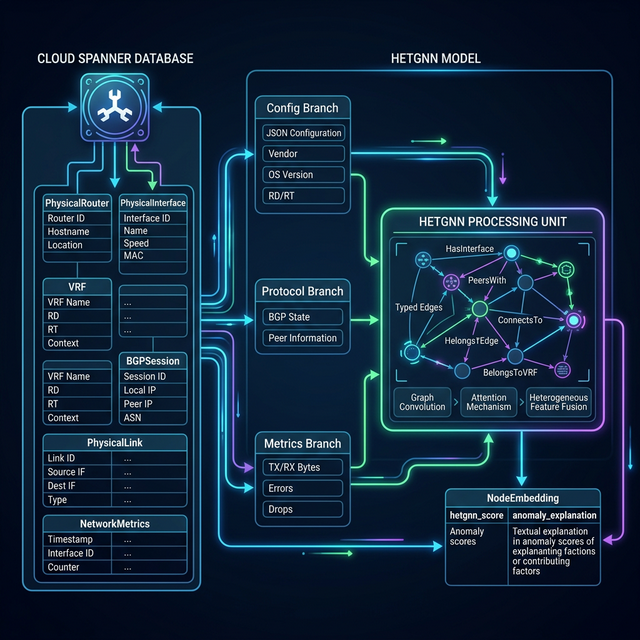

# Heterogeneous Graph Neural Networks (HetGNNs) for Root Cause Analysis over Spanner

This document describes how to construct a Heterogeneous Graph Neural Network (HetGNN) based on the network structure mapped in the Cloud Spanner `networkGraph`, and how to utilize it to pinpoint the root cause of network failures.

## 1. Introduction to HetGNN for Root Cause Analysis (RCA)

Unlike standard homogeneous GNNs (like GCNs or GATs) that treat all nodes and edges identically, a **HetGNN supports multiple types of nodes and edges**. A complex network environment like a carrier-grade L3VPN contains diverse entities: physical devices, logical protocols, traffic metrics, and configurations. By mapping each to distinct node/edge types, HetGNNs excel at untangling interconnected failures.

For RCA, HetGNNs can distinctly model the relationship between a `PhysicalRouter`'s configuration changes, an `PhysicalInterface`'s telemetry metrics, and a `BGPSession`'s state changes. When an anomaly occurs, analyzing which sub-embedding (Config, Protocol, or Metric) deviated the most isolates the root cause layer. 

## 2. Graph Construction from Spanner Entities

The Spanner database (`spanner.j2`) natively models network state using a property graph structure (`networkGraph`). We map the Spanner entities directly into HetGNN node and edge types structured across three primary branches: **Config**, **Protocol**, and **Metrics**.



### 2.1 Node Types and Branches

| Branch | Node Type | Spanner Entity | Source Data | Role in RCA |
| :--- | :--- | :--- | :--- | :--- |
| **Config** | `Router` | `PhysicalRouter` | Config JSON, Vendor, OS, Role, Status, Location | Hardware/OS/System-wide configuration drifts; role-aware blast radius |
| **Config** | `VRF` | `VRF` | RD, RT configs, Status | Policy misconfigurations, routing leaks, provisioning state |
| **Config** | `L3VPNService` | `L3VPNService` | Status, Topology type | Service-level health; topology context (hub vs. spoke blast radius) |
| **Protocol**| `BGP_Session` | `BGPSession` | State (UP/DOWN), Peers | Control plane failures, peer session drops |
| **Metrics** | `Interface` | `PhysicalInterface` (joined with `NetworkMetrics`) | TX/RX bytes, Errors, Drops, MTU, **Operational Status** | Data plane drops, queue congestion, hardware faults, admin actions |
| **Metrics** | `Link` | `PhysicalLink` | Bandwidth, **Operational Status** | Transport failures, physical medium cuts |
| **Metrics** | `Subnet` | `LogicalSubnet` | MTU, Operational State, Network Type | MTU mismatches, bridge failures, subnet-level reachability |

### 2.2 Edge Types (Message Passing Paths)

The edges define how information propagates during GNN message passing. We map Spanner's edge views directly into distinct, typed HetGNN message passing layers:

- `HasInterface` (Router → Interface): Propagates router-wide CPU/Memory metrics and configurations directly to the interface's data-plane representation.
- `LocatedOn` (VRF → Router): Maps logical routing instances back to their physical host to correlate hardware failures with control-plane effects.
- `BelongsToVRF` (BGPSession → VRF): Allows BGP session flaps to influence the VRF embedding, isolating which customer VPNs are impacted by a peering drop.
- `ConnectsTo` (Interface → Link): Bridges interfaces to construct the end-to-end transport path.
- `PeersWith` (BGPSession → BGPSession): The primary dimension for control plane propagation.
- `AssociatedWith` (Interface → Subnet): Links physical interfaces to their logical subnets, propagating MTU and bridge operational state into the interface's context. Critical for detecting MTU mismatch faults.
- `RealizesVPN` (VRF → L3VPNService): Propagates per-VRF anomalies up to the service level; allows the model to learn hub vs. spoke topology asymmetry in failure propagation.

## 3. Feature Engineering from Spanner

To train the HetGNN, we must encode the raw structural and metric data from Spanner into numerical tensors for each node type. 

### 3.1 Config Branch Features (`Router`, `VRF`, `L3VPNService`)

The config branch is typically sparse (updates only on human/automation intervention).

#### `Router` (PhysicalRouter)
- `vendor` / `model`: One-hot encoded.
- `role`: One-hot encoded `[PE, P, CE, RR]`. Provides topology-aware context — a P-core router failure has a larger blast radius than a CE edge router. The model learns role-specific normal embeddings.
- `status`: Binary encoding (`Running` = 1, all others = 0). A transition to `Failed` is a direct fault indicator.
- `location_lat` / `location_lon`: Normalized 2D float. Allows the model to learn geographic co-location patterns — routers in the same datacenter have correlated failure modes (power events, cooling).
- OSPF domain / AS: Hashed into an embedding.

#### `VRF`
- `Route Distinguisher (RD)` / `Route Targets (RT)`: Extracted from `config` JSON and hashed into learned embeddings. A sudden change in hash distance signals a configuration drift.
- `status`: Binary encoding (`Active` = 1, `Pending` = 0). A VRF stuck in `Pending` indicates a provisioning failure.

#### `L3VPNService` *(new node type)*
- `status`: Binary encoding (`Ready` = 1, else = 0). Service-level health signal.
- `topology`: One-hot encoded `[hub, spoke, mesh]`. Informs the model of the service's role — a `hub` VPN failing has much higher customer impact than a `spoke`. The model learns this asymmetry via the `RealizesVPN` edge.
- `service_perf_response_time_mean`: Rolling mean of `ServicePerformance.response_time_ms` for this VPN over the snapshot window. Log-scaled.
- `service_perf_error_rate`: Rolling fraction of `ServicePerformance.error = true` entries. The most direct customer-impact signal available in Spanner.

### 3.2 Protocol Branch Features (`BGP_Session`)

The protocol branch captures state machine changes.

- `status`: Binary encoding (`Established` = 1, all others = 0).
- `session_flaps`: Rolling count of state transitions in the last 15 minutes.
- `uptime`: Log-scaled seconds since last state change. (Captures BGP session resets).
- `received_prefixes`: Normalized vs historical baseline. Sudden drops to 0 reliably indicate isolation even if the session remains UP.
- `local_as` / `remote_as`: Hashed. Allows the model to learn that iBGP sessions (same AS) and eBGP sessions have different failure patterns.

### 3.3 Metrics Branch Features (`Interface`, `Link`, `Subnet`)

The metrics branch uses high-frequency data from the `NetworkMetrics` table and operational state from SCD tables.

#### `Interface` (PhysicalInterface + NetworkMetrics)
- **Operational state** (from `PhysicalInterface.status`):
  - `status_encoded`: Ternary encoding: `UP` = 1, `ADMIN_DOWN` = -1, `DOWN` = 0. The `ADMIN_DOWN` value is critical — it distinguishes a deliberate operator shutdown from an unexpected failure, preventing false-positive RCA attribution.
- **Continuous values via `NetworkMetrics`**:
  - `rx_bytes`, `tx_bytes`: Log-scaled rate (bytes/sec)
  - `rx_drops`, `tx_drops`: Log-scaled rate (drops/sec)
  - `rx_errors`, `tx_errors`: Rate (errors/sec)
- **Derived Temporal Metrics** (calculated before graph ingestion):
  - `drop_acceleration`: The second derivative of the drop count. Helps predict hardware failures (`PhysicalLink` components degrading before full sever).
  - `tx_rx_asymmetry`: `abs(tx_bytes - rx_bytes) / (tx_bytes + rx_bytes + ε)`. High asymmetry on an interface connected to an MTU-mismatched link is a reliable early indicator.

#### `Link` (PhysicalLink)
- `bandwidth_normalized`: Normalized bandwidth capacity.
- `status_encoded`: Binary encoding (`UP` = 1, `DOWN` = 0). A `DOWN` PhysicalLink is the strongest single signal for a physical-layer fault.

#### `Subnet` (LogicalSubnet) *(new node type)*
- `mtu_normalized`: `mtu / 1500`. The most important feature for detecting MTU mismatch faults (the flagship RCA scenario). MTU changes create new SCD rows, making `mtu_delta` (difference between current and previous SCD row's MTU) a high-signal change indicator.
- `mtu_delta`: Change in MTU from the prior SCD row. Non-zero value indicates an operator configuration change.
- `operational_state_encoded`: Binary encoding (`UP` = 1, else = 0). Bridge/subnet operational state from Linux kernel via `/sys/class/net/<bridge>/operstate`.
- `network_type_encoded`: One-hot `[p2p, management, custom]`. P2P subnets are on the transit path; management subnets are out-of-band. Different failure modes apply.

## 4. Training the HetGNN for RCA

### 4.1 Multi-Task Reconstruction Objective

The HetGNN uses self-supervised learning, trained to reconstruct healthy network features. Because there are three semantically distinct branches, the loss function is a weighted sum of three independent reconstruction tasks:

```text
Loss_total = α × Loss_config (MSE) + β × Loss_protocol (BCE) + γ × Loss_metrics (MSE)
```

- **Loss_config**: Mean Squared Error on normalized config tensors. Covers `Router`, `VRF`, `L3VPNService` node types.
- **Loss_protocol**: Binary Cross-Entropy on BGP session UP/DOWN state.
- **Loss_metrics**: Mean Squared Error on log-scaled interface drop/error counters, link status, and subnet MTU.

*(Recommended weights: α = 0.3, β = 0.3, γ = 0.4. The metrics branch carries the heaviest weight because hardware drops are often silent and MTU mismatches produce no control-plane signal).*

> **Note on current code:** `train_hetgnn.py` currently uses `ALPHA=0.4, BETA=0.4, GAMMA=0.2`, which under-weights the metrics branch. This should be corrected to `ALPHA=0.3, BETA=0.3, GAMMA=0.4` to match the design intent. Use the "Quiet Config" oversampling strategy (Section 4.2) to compensate for config's low sample frequency rather than inflating α.

### 4.2 Handling the "Quiet Config" Problem

In Spanner, `NetworkMetrics` (metrics branch) generates millions of rows daily, while `PhysicalRouter` config might not change for months. A model trained naively will collapse the config branch. 

**Solution:** Oversample config events. When a row in `PhysicalRouter` changes (identified by a new `valid_start_ts` entry in Spanner), duplicate the network graph snapshots at `[T-5m, T, T+5m]` to heavily weight the configuration transition during the epoch training. The same applies to `LogicalSubnet` MTU changes — the SCD Type 2 history makes change detection explicit.

### 4.3 Architecture Notes

- **Layers (`NUM_LAYERS = 2`)**: Two layers is correct for this graph topology. The longest meaningful RCA path is 3 hops (e.g., `BGPSession → VRF → Router → Interface`), and 2 layers captures the 2-hop neighborhood sufficient to correlate cross-branch signals. Adding a 3rd layer risks over-smoothing, collapsing branch embeddings and erasing the deviation signals used for RCA attribution.
- **Hidden channels (`HIDDEN_CHANNELS = 64`)**: Adequate for current feature counts. If temporal feature windows (rolling statistics, delta features) are added, increase to `128` to give the encoder room to separate branch representations.
- **`aggr='sum'` in HeteroConv**: Combined with the contrastive diversity loss (`DIVERSITY_WEIGHT = 0.1`), this prevents representation collapse where all nodes of a type converge to the same embedding.

## 5. Root Cause Isolation Workflow (Inference)

When applied to the active Spanner state or queried retroactively over past timestamps, root cause pin-pointing follows a three-step workflow.

### Step 1: Anomaly Detection via NodeEmbedding

During the generation step, the network generates sub-embeddings and anomaly scores written back to the `NodeEmbedding` table:
`hetgnn_embedding`, `hetgnn_score`

A background job monitors for high `hetgnn_score` values crossing a threshold set at the 99th percentile of training loss.

### Step 2: Branch Deviation Isolation

Once an anomaly is flagged, the operator queries the node to find *which* branch failed to reconstruct properly.

- If `Loss_config` spikes → It's a configuration error (e.g., someone fat-fingered the MTU in Spanner, or changed an RT import policy).
- If `Loss_protocol` spikes → The BGP/OSPF control plane is crashing.
- If `Loss_metrics` spikes → It's a silent hardware/traffic drop (e.g., microbursts, failing optic, MTU mismatch causing large-packet drops while keepalives still pass).

The addition of `Subnet.mtu_delta` and `Interface.status_encoded` significantly sharpens this step: a `Loss_metrics` spike coinciding with a non-zero `mtu_delta` on an associated `Subnet` node strongly points to an MTU fault without requiring Integrated Gradients attribution.

### Step 3: Attribution via Integrated Gradients

To identify the exact component causing the failure:
- Apply **Integrated Gradients** attribution on the isolated branch.
- Example: If the config branch failed, Integrated Gradients will assign the highest impact score to the `vrf_rt_import` tensor field on `VRF-PE3`.
- Example: If the metrics branch failed on an `Interface` node, attribution over the `AssociatedWith` edge path will surface the `mtu_normalized` feature on the connected `Subnet` node.
- The system writes this back to the `anomaly_explanation` JSON field in `NodeEmbedding`, allowing the UI to surface: *"Root Cause: VRF BLUE_SPOKE import RT modified to 65035:9999"* or *"Root Cause: MTU on subnet:p1-pe1 changed from 1500 → 1400"*.

## 6. Real World Examples

### 6.1 Silent Blackholing via MTU Mismatch

1. **Event**: Operator sets `MTU` on `LogicalSubnet` (bridge `subnet:p1-pe1`) to 1400 (down from 1500).
2. **Spanner Update**: New SCD Type 2 row in `LogicalSubnet` with `mtu=1400`; `mtu_delta = -100`.
3. **Graph Response**: 
   - `AssociatedWith` (Interface → Subnet) propagates the `mtu_normalized` change into the `Interface` embedding.
   - `ConnectsTo` (Interface → Link) sees massive asymmetric metric changes (large BGP updates dropped). 
   - `PeersWith` (BGP → BGP) stays `Established` since tiny OSPF keepalives still fit in 1400 bytes.
4. **HetGNN Output**: 
   - `Loss_metrics` spikes on the `Interface` and `Subnet` nodes connected to `subnet:p1-pe1`.
   - `Subnet.mtu_delta = -100` is directly present in the reconstruction error — the model flags exactly which subnet changed.
   - Integrated Gradients attribution over `AssociatedWith` surfaces `mtu_normalized` as the top feature, pinpointing `subnet:p1-pe1`.
   - Written to `NodeEmbedding.anomaly_explanation`: *"Root Cause: MTU on subnet:p1-pe1 changed 1500→1400, causing large-packet drops on interface router:p1:interface:eth1"*.

### 6.2 PE Router Crash (Control and Data Plane Co-Failure)

1. **Event**: Router `pe1` container crashes; `VyOSRouter` transitions to `Failed`.
2. **Spanner Update**: New SCD row in `PhysicalRouter` with `status=Failed`; all child `PhysicalInterface` rows closed with `status=DOWN`.
3. **Graph Response**:
   - `Router.status_encoded` drops from 1 → 0 on `router:pe1`.
   - `Interface.status_encoded` drops from 1 → 0 on all `router:pe1:interface:*` nodes.
   - `BGPSession.status` drops to `Idle` on all sessions within `vrf:pe1:*`.
4. **HetGNN Output**: 
   - `Loss_config` spikes on `router:pe1` (status change).
   - `Loss_metrics` spikes on all attached interfaces (all go DOWN simultaneously).
   - `Loss_protocol` spikes on all BGP sessions within PE1's VRFs.
   - The co-occurrence of all three branch losses on nodes sharing `router_id = router:pe1` localises the fault to the router rather than attributing it to each individual interface or BGP session separately.
   - `Router.role = PE` (one-hot) informs the model this is a customer-facing node, correctly weighting the anomaly score higher than a P-core failure affecting only transit.
